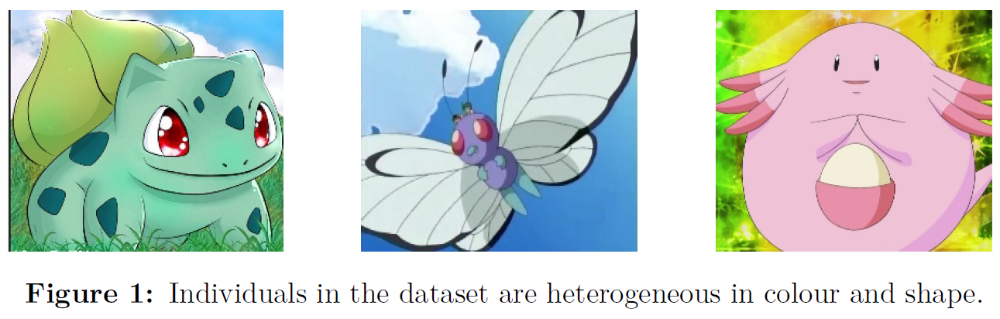

.. Implementation of a simple Content-Based Image Retrieval system. documentation master file, created by
   sphinx-quickstart on Wed Jun  9 10:43:12 2021.
   You can adapt this file completely to your liking, but it should at least
   contain the root `toctree` directive.

Documentation for the implementation of a simple content-based image retrieval system.
======================================================================================
Content-based image retrieval (CBIR) aims at finding similar images from large scale datasets against query images. The degree of commonality between images is often computed accounting for (i) a set of representative features of each sample, and (ii) a set of similarity measures, e.g., distance functions, that quantify the extent to which each feature in each pair of samples matches. Visual cues such as colour, texture and shape are among the most prominent image feature descriptors, and exploiting the appropriate ones for a given problem is key to the success of the retrieval process.

In this work, we review various techniques that enable users retrieve images, provided a set of meaningful search criteria. We state such criteria to be meaningful in the sense that they are easy and fast to formulate, i.e., effort and time required for the user to specify search conditions are measurably lesser than manually inspecting the dataset; and in such manner that they help to best describe and discriminate target images.

Specifically, data under consideration, published in (Kolman, 2021), is a collection of images of 143 different Pokemons, fictional creatures characterized by their inter-class heterogeneous colours and shapes. Regardless of the very problem domain, what we hereby aim at reviewing is a set of simple techniques that may be transversely applicable to other paradigms of interest where those descriptors are of vital relevance. Namely, we explore the use of different histogram comparison methods, unsupervised classification techniques to yield the most relevant colours of an image, and algorithms for Keypoint description such as SIFT (Lowe, 1999).

References 
-----------
Kolman, M. (2021, jun). *First Generation Pokemon Images*. Retrieved 2022-03-24, from https://www.kaggle.com/datasets/mikoajkolman/pokemon-images-first-generation17000-files

Lowe, D. G. (1999). Object recognition from local scale-invariant features. *Proceedings of the IEEE International Conference on Computer Vision, 2*, 1150–1157. doi: 10.1109/ICCV.1999.790410

.. toctree::
   :maxdepth: 2
   :caption: Contents:
   
   code
   
Indices and tables
==================

* :ref:`genindex`
* :ref:`modindex`
* :ref:`search`
